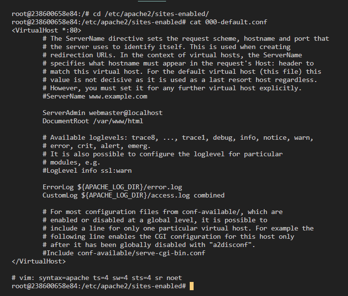

## Лабораторная работа №3 
## Использование контейнеров как среды выполнения

Содержание

1. [Лабораторная работа №3](#лабораторная-работа-№3)
2. [Цель работы](#цель-работы)
3. [Задание](#задание)
4. [Запуск и тестирование](#запуск-и-тестирование)

## Цель работы
Данная лабораторная работа призвана напомнить основные команды ОС Debian/Ubuntu. Также она позволит познакомиться с Docker и его основными командами.

## Задание
Запустить контейнер Ubuntu, установить Web-сервер Apache и вывести в браузере страницу с текстом "Hello, World!".

## Запуск и тестирование
Откройте терминал в папке containers03 и выполните команду:
```
docker run -ti -p 8000:80 --name containers03 ubuntu bash
```
В открывшемся окне выполните следующие команды и объясните их назначение:

* ```apt update``` -  обновляет индекс пакетов в системе Linux или списки пакетов.

* ```apt install apache2 -y``` - установка apache2, "-y" - подтверждение действий по умолчаю "да" 

* ```service apache2 start``` - запуск приложения apache2

Откройте браузер и введите в адресной строке http://localhost:8000. Что вы видите?

   * Открывается "Apache2 Default Page".

Выполните следующие команды:

```
ls -l /var/www/html/
echo "<h1>Hello, World</h1>" > /var/www/html/index.html
```
Обновите страницу в браузере. Что вы видите?

   * Я вижу свой index.html, а именно вывод содержимого в браузере Hello, World

   

Выполните следующие команды:
```
cd /etc/apache2/sites-enabled/
cat 000-default.conf
```
Что вы видите на экране?

Конфигурационный файл Apache для виртуального хоста, который обслуживает запросы на порту 80



Закройте окно терминала командой exit.

Просмотрите список контейнеров:

```docker ps -a``` - вывод работающих крнтейнеров 


Удалите контейнер:

```docker rm containers03``` - команда для удаления контейнера 


containers03 был удален, его нет ни в запущенных контейнерах ни в списке всех контейнеров .


Для каждой команды объясните её назначение, результат выполнения и вывод в консоли. Желательно привести скриншоты.